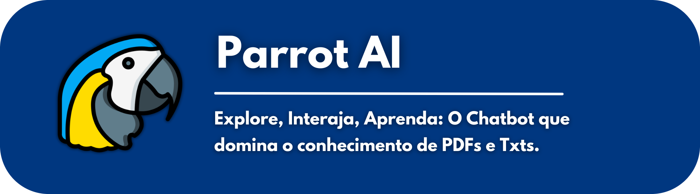

### Segundo Semestre (2023-2)

O projeto desenvolvido no segundo semestre do curso de ADS teve como empresa parceira a própria fatec. Os requisitos foram apresentados pelo professor Giuliano Bertoti, que assumiu o papel de cliente final.

O problema abordado pelo meu grupo consiste na dificuldade de ler informações selecionadas de currículos profissionais. Um recrutador por exemplo, muitas vezes não tem tempo para ler minuciosamente todos os detalhes de um curriculo, ou ele está procurando por uma qualidade específica em um candidato.

Como solução, minha equipe desenvolveu o ParrotAI, um chatbot avançado construído em Java, impulsionado pela poderosa biblioteca langchain. Sua principal habilidade reside na capacidade de compreender e responder perguntas detalhadas relacionadas a um arquivo específico. Com o uso do processamento de linguagem natural, este chatbot oferece interações inteligentes e contextuais, permitindo aos usuários extrair informações precisas e relevantes do conteúdo do arquivo carregado.

- [GIT](https://github.com/C0demain/ParrotAI)

#### Tecnologias Utilizadas

As seguintes tecnologias foram utilizadas neste projeto:
- Figma: Ferramenta online para design e prototipação de interfaces de usuário.
- Java: Linguagem de programação ensinada durante o segundo semestre e obrigatório neste projeto;
- Java Swing: Biblioteca para criação de interfaces gráficas em Java.
- Eclipse: IDE para desenvolvimento com java;
- MySQL: Banco de dados relacional para armazenar as informações do usuário;
- Langchain4j: Biblioteca responsável por fazer a leitura, embedding e interpretação do arquivo desejado;
- Gradle: Ferramenta para gerenciamento das dependencias;
- Trello: Ferramenta de gerenciamento de tarefas baseada em quadros Kanban.

#### Contribuições Pessoais

  Neste projeto atuei como **Dev Team**, sendo responsável por participar do desenvolvimento da interface (GUI) de upload dos documentos, os quais serão lidos e interpretados pelo chatbot. Além disso, contribui com o melhoramento das respostas da IA da biblioteca langchain estudando seu funcionamento e integração com ferramentas como Hugging Face.

#### Hard Skills

Exercitei as seguintes hard skills durante esse projeto:
- Java - Uso com ajuda
- Java Swing - Uso com autonomia
- Eclipse - Uso com ajuda
- MySQL - Uso com ajuda

#### Soft Skills

- Resiliência: Durante o desenvolvimento, enfrentei desafios relacionados ao domínio de Java e à aplicação de conceitos de orientação a objetos. No entanto, mantive o foco, buscando recursos de aprendizado, estudando exemplos e solicitando apoio da equipe. Essa persistência foi fundamental para superar as dificuldades e garantir a entrega das funcionalidades.

- Colaboração: Trabalhei em conjunto com outros membros da equipe para entender melhor a integração da biblioteca LangChain com o Java, realizando sessões de estudo em grupo e discutindo soluções para melhorar as respostas do chatbot.

- Proatividade: Diante das dificuldades com o Java e o uso da biblioteca LangChain, tomei a iniciativa de aprofundar meus estudos e explorar documentações e exemplos práticos. Também pesquisei integrações com ferramentas como Hugging Face para aprimorar a IA do chatbot.

- Aprendizado Contínuo: Apesar das dificuldades iniciais, busquei constantemente novos conhecimentos sobre Java e orientação a objetos, o que me permitiu evoluir significativamente ao longo do projeto.

