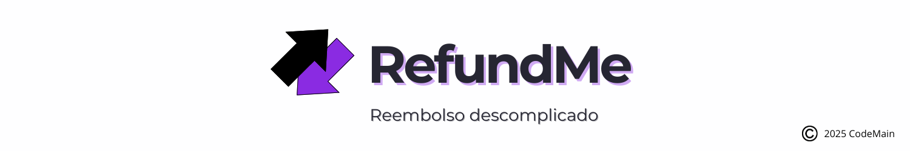

### Quinto Semestre (2025-1)

No quinto semestre do curso de Análise e Desenvolvimento de Sistemas da Fatec São José dos Campos, desenvolvemos um projeto em parceria com a **GSW Software**, uma empresa referência em soluções corporativas. O projeto, denominado **RefundMe**, foi proposto como parte de um desafio prático da empresa para os alunos.

No ambiente corporativo da GSW, identificou-se uma dificuldade crescente no controle e acompanhamento das despesas realizadas pelos colaboradores. Os pedidos de reembolso eram gerenciados por diferentes meios e formatos, o que gerava inconsistências, atrasos na análise e falta de transparência para os funcionários. Além disso, os gestores tinham dificuldade para aplicar regras de aprovação de forma padronizada e para manter uma visão clara do histórico de solicitações, o que impactava a agilidade e a confiabilidade do processo de reembolso.

A proposta consistiu em desenvolver um **sistema completo de reembolso corporativo**, permitindo que funcionários registrem suas solicitações de reembolso de despesas, anexem comprovantes e acompanhem o status de aprovação. Ao mesmo tempo, gestores utilizam um **painel administrativo (backoffice)** exclusivo para aprovar ou rejeitar essas solicitações com base em regras previamente definidas, como limites de valor por projeto.

O sistema é composto por três frentes:

* **Aplicativo Mobile** voltado para os funcionários;
* **Backoffice Web** exclusivo para os gestores;
* **API robusta** com autenticação segura e hospedagem em nuvem.

Essa divisão garantiu uma solução escalável, intuitiva e adequada ao ambiente corporativo proposto.

* [GIT](https://github.com/C0demain/refundme)

---

#### Tecnologias Utilizadas

As tecnologias empregadas no desenvolvimento do RefundMe foram:

* **Figma**: Para prototipação das interfaces do aplicativo e do backoffice;
* **Trello**: Gerenciamento de tarefas e organização de sprints;
* **Nest.js**: Desenvolvimento da API com suporte a autenticação e regras de negócio complexas;
* **React Native**: Criação do app mobile multiplataforma;
* **Expo**: Desenvolvimento e deploy de apps móveis com React Native;
* **Next.js**: Framework React para desenvolvimento do backoffice;
* **TailwindCSS**: Estilização rápida e responsiva;
* **Typescript**: Tipagem estática para garantir maior segurança no código;
* **TypeORM**: ORM para integração com banco de dados relacional;
* **PostgreSQL**: Banco de dados utilizado no projeto;
* **Docker**: Contêineres para padronização de ambiente;
* **AWS**: Hospedagem da API e dos serviços do sistema.

---

#### Contribuições Pessoais

Durante o projeto RefundMe, atuei principalmente como **Product Owner (PO)** da equipe, tendo como principais responsabilidades:

* **Contato direto com o cliente da GSW**, realizando contatos frequentes via Slack para entender os requisitos reais da empresa, propondo soluções e validando fluxos;
* **Mediação entre o time técnico e o cliente**, garantindo clareza nas entregas e no entendimento dos requisitos, levando dúvidas da equipe e retornando com informações precisas;
* **Proposição de fluxos de uso e funcionalidades**, alinhando com as necessidades do cliente e transformando as ideias em tarefas no Trello e no Backlog;

Além das atividades de PO, também **contribuí tecnicamente** no desenvolvimento da API e do sistema de autenticação, especialmente:

* Implementação da **diferenciação de login por nível de acesso**, garantindo que usuários com perfil `admin` tenham acesso exclusivamente ao **backoffice**, enquanto usuários comuns (`user`) acessam apenas o **aplicativo mobile**;
* Validação de acesso nas rotas protegidas da API;
* Apoio técnico pontual ao time, principalmente em momentos de dúvidas sobre regras de negócios e integração entre as camadas da aplicação.

---

#### Hard Skills

* **Nest.js**: Uso com ajuda;
* **Next.js**: Uso com ajuda;
* **Expo**: Uso com ajuda;
* **React Native**: Uso com ajuda;
* **Docker**: Uso com autonomia;
* **PostgreSQL**: Uso com autonomia;
* **AWS**: Uso com autonomia;
* **GitFlow**: Uso com autonomia;
* **Typescript**: Uso com autonomia.

---

#### Soft Skills

- **Comunicação Técnica Orientada ao Cliente**: Mantive contato contínuo via Slack com o representante da GSW para esclarecer regras de negócio, validar fluxos de uso e confirmar detalhes importantes, transformando necessidades corporativas complexas em orientações claras e acionáveis para a equipe técnica.

- **Mediação Estratégica entre Cliente e Equipe**: Atuei como ponto central de alinhamento, traduzindo requisitos muitas vezes abstratos em funcionalidades concretas, registrando tarefas no Trello e garantindo que nada fosse perdido ou interpretado de forma incorreta — essencial para manter a coesão entre visão do cliente e execução da equipe.

- **Liderança de Produto com Foco em Prioridades de Negócio**: Realizei a organização e priorização do backlog considerando impacto real para o cliente, prazos das sprints e dependências técnicas, orientando o time sobre o que era mais crítico para cada etapa do desenvolvimento.

- **Resolução Rápida de Problemas Críticos de Demonstração**: Após a falha inicial com o emulador Expo na Sprint 1, conduzi um processo de diagnóstico e preparo prévio para evitar novas interrupções, definindo boas práticas de testes antes de demos futuras — garantindo entregas mais confiáveis e profissionais.

- **Suporte Técnico Direcionado ao Time**: Além da atuação como PO, ofereci apoio técnico em pontos sensíveis, como regras de autenticação, diferenciação de perfis (admin vs. user) e comportamento de rotas protegidas, evitando retrabalho e ajudando o time a implementar fluxos condizentes com o modelo de negócios.

- **Alinhamento de Fluxos Operacionais Complexos**: Trabalhei diretamente na modelagem e validação dos fluxos de aprovação, limites por projeto, interação entre app e backoffice e regras de acesso, garantindo que a lógica representasse fielmente o processo corporativo da GSW.

---

  

 

